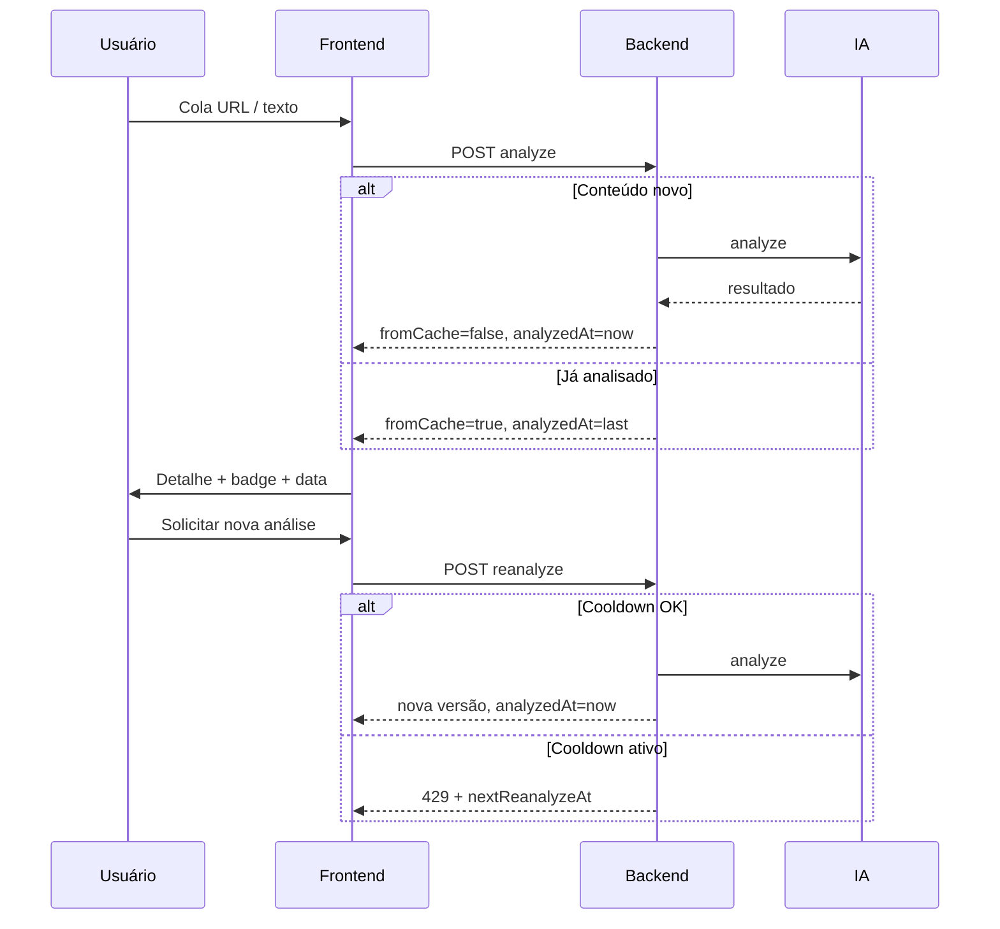

# Plano — Portal público e reutilização de análises

Documento de referência para evoluir o FakeRadar de **ferramenta privada por usuário** para **portal público**, onde todo conteúdo analisado entra no catálogo compartilhado, com reutilização de resultados e reanálise controlada.

**Última revisão:** 2025-06-02  
**Status:** implementado (fases 0–7)

## Decisões aprovadas (2025-06-02)

| # | Decisão |
|---|---------|
| 1 | Portal legível **sem login** |
| 2 | Cooldown de reanálise: **24 horas** (`REANALYZE_COOLDOWN_HOURS=24`) |
| 3 | Exclusão: só quem **submeteu primeiro**, dentro de **30 minutos** (`DELETE_WINDOW_MINUTES=30`) |
| 4 | URL como chave quando URL + texto no mesmo envio |
| 5 | Histórico de versões **visível** no detalhe (v1) |  
**Relacionado:** [PLANO.md](./PLANO.md) (infra), [frontend/FRONTEND-PLANO.md](./frontend/FRONTEND-PLANO.md) (UI incremental)

---

## Objetivo de produto

| Hoje | Depois |
|------|--------|
| Cada análise pertence a um usuário e só ele vê | Toda análise alimenta um **portal público** |
| Mesma URL analisada N vezes = N registros independentes | Mesma URL (normalizada) reutiliza o **último resultado publicado** |
| Usuário sempre dispara IA ao escanear | Se já existe análise válida → **mostra cache**; IA só roda se for nova ou **reanálise solicitada** |
| Data da análise pouco destacada | UI mostra **quando foi analisado**; distingue resultado em cache vs. novo |

---

## Princípios de desenho

1. **Conteúdo ≠ execução da análise**  
   Separar a “matéria” (URL ou texto identificável) da “rodada de análise” (snapshot com score, claims, fontes, timestamp).

2. **Portal é a fonte da verdade para leitura**  
   Listagem e detalhe públicos leem o catálogo compartilhado, não o histórico privado por `userId`.

3. **Reanálise é exceção explícita**  
   Botão/ação dedicada, com **cooldown mínimo** por conteúdo (anti-spam e anti-retrabalho na IA).

4. **Transparência**  
   Resposta da API e UI deixam claro: `analyzedAt`, se veio de cache, quantas versões existem, e quando pode pedir de novo.

5. **Compatibilidade**  
   Migração dos `Analysis` atuais para o novo modelo sem perder dados já gravados.

---

## Modelo de dados proposto

### Entidades novas / alteradas

```
┌─────────────────┐       ┌──────────────────┐
│  ContentItem    │ 1───* │  AnalysisVersion   │
│  (catálogo)     │       │  (rodada de IA)    │
└─────────────────┘       └──────────────────┘
        │                           │
        │                           ├── claims, sources (como hoje)
        │                           ├── credibilityScore, verdict
        │                           ├── analyzedAt (createdAt da rodada)
        │                           ├── triggeredByUserId (quem pediu)
        │                           └── isLatest (boolean ou derivado)
```

**`ContentItem`** — item público do portal  
| Campo | Descrição |
|-------|-----------|
| `id` | UUID |
| `kind` | `URL` \| `TEXT` |
| `canonicalKey` | Chave única: URL normalizada **ou** hash do texto normalizado |
| `displayUrl` | URL original (se aplicável) |
| `title` | Título extraído do scrape ou primeiras linhas (opcional na v1) |
| `snippet` | Trecho curto para cards do feed |
| `latestAnalysisId` | FK para a versão exibida no portal |
| `firstAnalyzedAt` | Primeira análise publicada |
| `lastAnalyzedAt` | Última análise publicada (para UI e cooldown) |
| `analysisCount` | Número de versões |

**`AnalysisVersion`** (evolução do `Analysis` atual)  
| Campo | Descrição |
|-------|-----------|
| `contentItemId` | FK obrigatório |
| `triggeredByUserId` | Quem disparou (primeira vez ou reanálise) |
| Demais campos | Iguais ao `Analysis` atual (`rawText`, `verdict`, `claims`, etc.) |

**Remover ou repensar:**  
- Filtro `where: { userId }` como regra de leitura do portal.  
- **Exclusão pelo usuário:** análises públicas não devem sumir do portal por DELETE do autor. Opções: remover botão de excluir; ou soft-delete só para “minha lista” (fase posterior).

### Normalização de URL (deduplicação)

Antes de buscar/criar `ContentItem`:

- lowercase do host  
- remover fragmento `#...`  
- remover query params de tracking (`utm_*`, `fbclid`, etc.) — lista configurável  
- trailing slash consistente  
- opcional: seguir redirect uma vez e gravar URL final como `canonicalKey`

**Texto colado (sem URL):**  
- normalizar espaços/quebras  
- `canonicalKey = sha256(normalizedText)`  
- limite mínimo de caracteres (ex.: 80) para evitar spam de frases curtas

> **Decisão para aprovar:** URL e texto no mesmo POST — priorizar URL como chave se ambos existirem, ou tratar como dois tipos de conteúdo distintos.

---

## Regras de negócio

### 1. Nova submissão (escanear)

```
POST /api/analyses  (ou POST /api/portal/analyze)
```

| Cenário | Comportamento |
|---------|----------------|
| `canonicalKey` não existe | Rodar IA → criar `ContentItem` + `AnalysisVersion` → publicar |
| `canonicalKey` existe | **Não** rodar IA → retornar `latestAnalysis` + metadados `fromCache: true` |
| Texto-only com hash igual | Idem cache |
| Texto-only hash diferente | Novo `ContentItem` (conteúdo diferente) |

Resposta inclui sempre:

```json
{
  "fromCache": true,
  "analyzedAt": "2025-06-01T14:30:00.000Z",
  "contentItemId": "...",
  "analysisId": "...",
  "nextReanalyzeAt": "2025-06-02T14:30:00.000Z",
  "canReanalyze": false
}
```

### 2. Reanálise explícita

```
POST /api/content/:contentItemId/reanalyze
```

| Regra | Valor sugerido (configurável via `.env`) |
|-------|------------------------------------------|
| Cooldown desde `lastAnalyzedAt` | **24 horas** (`REANALYZE_COOLDOWN_HOURS=24`) |
| Autenticação | Obrigatória (evita abuso anônimo) |
| Efeito | Nova `AnalysisVersion`; atualiza `latestAnalysisId` e `lastAnalyzedAt` |
| Motivo opcional | Campo `reason` no body (ex.: `"texto alterado"`) para logs |

Se dentro do cooldown → `429` com mensagem e `nextReanalyzeAt`.

### 3. Portal público (leitura)

| Endpoint | Auth | Descrição |
|----------|------|-----------|
| `GET /api/portal/items` | Opcional / nenhuma | Feed paginado, ordenado por `lastAnalyzedAt` desc |
| `GET /api/portal/items/:id` | Opcional / nenhuma | Detalhe + última versão |
| `GET /api/portal/items/:id/versions` | Opcional | Histórico de versões (para transparência) |

Filtros sugeridos: `verdict`, busca por URL/domínio/snippet, paginação `cursor` ou `page`.

> **Decisão para aprovar:** portal 100% público sem login para **ler**, ou exigir login também para navegar (só reanálise exige login).

### 4. Histórico pessoal (opcional na v1)

Manter área “Minhas contribuições” (`triggeredByUserId = eu`), sem substituir o feed público. Pode ser fase posterior se o feed público for suficiente.

---

## Fluxos (resumo)



---

## Impacto no frontend

| Área | Mudança |
|------|---------|
| **Rota principal** | `/` ou `/portal` — feed público com cards (badge + `analyzedAt`) |
| **Detalhe** | `/portal/[contentItemId]` ou manter `/analyses/[id]` redirecionando para item público |
| **Escanear** | Após POST: se `fromCache`, banner “Resultado de análise anterior em {data}” + botão reanalisar |
| **Reanalisar** | Botão desabilitado com tooltip até `nextReanalyzeAt`; confirmação modal |
| **Dashboard atual** | Evoluir para portal ou manter como “verificar” + link para feed |
| **Excluir** | Remover ou esconder para itens públicos |

Formatação de data: relativa (“há 2 dias”) + absoluta no tooltip (`pt-BR`).

---

## Fases de implementação

### Fase 0 — Alinhamento e decisões (~0,5 dia)

**Bloqueante antes de código.**

- [ ] Confirmar: leitura do portal **sem login** ou com login
- [ ] Confirmar cooldown padrão (24h?) e se admin pode ignorar
- [ ] Confirmar política de DELETE (remover para público?)
- [ ] Confirmar regra URL + texto no mesmo formulário
- [ ] Confirmar se versões antigas ficam visíveis no detalhe público

**Entregável:** seção “Decisões aprovadas” no topo deste documento preenchida.

---

### Fase 1 — Modelo de dados e migração (~1–2 dias)

**Backend + Prisma**

- [ ] Criar `ContentItem` e refatorar `Analysis` → `AnalysisVersion` (ou adicionar campos sem rename brusco)
- [ ] `canonicalKey` único em `ContentItem`
- [ ] Script de migração: cada `Analysis` existente vira 1 `ContentItem` + 1 versão; `latestAnalysisId` preenchido
- [ ] Utilitário `normalizeUrl()` e `hashText()` em módulo compartilhado
- [ ] Índices: `canonicalKey`, `lastAnalyzedAt`, `verdict` na versão latest

**Critério de conclusão:** `prisma migrate` sobe sem perda; dados antigos aparecem como itens do catálogo.

---

### Fase 2 — API: cache hit e criação (~1–2 dias)

**Backend**

- [ ] Alterar `POST /api/analyses`: lookup por `canonicalKey` antes de chamar IA
- [ ] Resposta padronizada com `fromCache`, `analyzedAt`, `contentItemId`, `canReanalyze`, `nextReanalyzeAt`
- [ ] Ao criar novo: vincular `ContentItem` + versão; incrementar `analysisCount`
- [ ] Logs RabbitMQ: eventos `analysis.cache_hit`, `analysis.created`, `analysis.reanalyze`

**Critério de conclusão:** segunda submissão da mesma URL não chama IA; resposta indica cache.

---

### Fase 3 — API: reanálise com cooldown (~1 dia)

**Backend**

- [ ] `POST /api/content/:id/reanalyze` com `requireAuth`
- [ ] Validação de cooldown (`REANALYZE_COOLDOWN_HOURS`)
- [ ] Nova versão torna-se `latest`; portal lista data atualizada
- [ ] Testes unitários/integração para 429 e sucesso

**Critério de conclusão:** reanálise antes do cooldown falha; depois roda IA e atualiza `lastAnalyzedAt`.

---

### Fase 4 — API: portal público (~1–2 dias)

**Backend**

- [ ] `GET /api/portal/items` (paginação, filtro veredito, busca)
- [ ] `GET /api/portal/items/:id` (detalhe completo da última versão)
- [ ] (Opcional v1) `GET .../versions` — histórico de rodadas
- [ ] Remover ou restringir rotas antigas que filtram só por `userId` para leitura pública
- [ ] Documentar contrato OpenAPI / README backend

**Critério de conclusão:** feed acessível conforme decisão da Fase 0; qualquer item analisado aparece na listagem.

---

### Fase 5 — Frontend: portal e datas (~2–3 dias)

**Next.js**

- [ ] Página feed público (`/portal` ou `/`)
- [ ] Cards: badge veredito, snippet, domínio, **`analyzedAt` formatado**
- [ ] Página detalhe pública (claims, fontes, explicação, data)
- [ ] Atualizar `lib/api.ts` com novos tipos e endpoints
- [ ] Navegação: Portal | Verificar | Login

**Critério de conclusão:** usuário anônimo (se aprovado) ou logado vê feed com datas; clique abre detalhe.

---

### Fase 6 — Frontend: escanear, cache e reanalisar (~1–2 dias)

**Next.js**

- [ ] Após escanear: banner se `fromCache === true` (“Analisado em …”)
- [ ] Botão “Solicitar nova análise” → chama reanalyze; estados loading / erro cooldown
- [ ] Mensagem amigável quando `429` (tempo restante)
- [ ] Remover/ajustar exclusão de análise pública
- [ ] Redirect pós-scan para detalhe do **content item** (não só analysis id legado)

**Critério de conclusão:** fluxo completo percebido pelo usuário conforme objetivo de produto.

---

### Fase 7 — Testes, rate limit e endurecimento (~1–2 dias)

- [ ] E2E API: cache hit, reanalyze cooldown, feed público
- [ ] E2E Playwright: feed visível, banner cache, botão reanalisar desabilitado/habilitado
- [ ] Rate limit global por IP/usuário em `POST analyze` e `reanalyze` (ex.: 10/h) — camada extra além do cooldown por item
- [ ] Atualizar `README.md`, `PLANO.md`, este documento (registro de progresso)

**Critério de conclusão:** CI/local verde; abuso básico mitigado.

---

### Fase 8 — Opcional / pós-MVP

- [ ] Ingestão automática (RSS) alimentando fila de análise
- [ ] Título/imagem Open Graph no card
- [ ] Moderação / ocultar item do portal
- [ ] “Minhas contribuições”
- [ ] Comparação diff entre versões (texto antigo vs. novo scrape)

---

## Ordem sugerida

```
Fase 0 → 1 → 2 → 3 → 4 → 5 → 6 → 7 → (8)
```

Demo mínima do portal após **Fase 4 + 5** (feed + detalhe).  
Experiência completa do usuário após **Fase 6**.

---

## Variáveis de ambiente novas

| Variável | Padrão | Uso |
|----------|--------|-----|
| `REANALYZE_COOLDOWN_HOURS` | `24` | Tempo mínimo entre reanálises do mesmo item |
| `PORTAL_PAGE_SIZE` | `20` | Paginação do feed |
| `ANALYZE_RATE_LIMIT_PER_HOUR` | `10` | Limite por usuário/IP (Fase 7) |
| `URL_STRIP_QUERY_PARAMS` | `utm_source,utm_medium,...` | Normalização |

---

## Riscos e mitigações

| Risco | Mitigação |
|-------|-----------|
| Mesma URL, texto da página mudou | Reanálise explícita + cooldown; futuro: hash do `rawText` na versão |
| Custo de IA disparado em massa | Cache + cooldown + rate limit |
| Privacidade (texto colado sensível) | Aviso na UI: “texto publicado no portal”; opcional: marcar TEXT como privado (fase 8) |
| Migração quebra frontend antigo | Manter `analysisId` na resposta durante transição; rotas legado deprecated |

---

## Registro de progresso

| Data | Fase | Status | Notas |
|------|------|--------|-------|
| 2025-06-02 | 0–7 | Portal público, cache, reanálise, exclusão, frontend | implementado |

---

## Checklist de aprovação

Marque o que você aprova (ou indique ajustes):

- [ ] Portal legível **sem login** / **com login obrigatório**
- [ ] Cooldown de reanálise: ___ horas
- [ ] Remover botão excluir para conteúdo público
- [ ] URL + texto no mesmo envio: priorizar URL / tratar separado
- [ ] Histórico de versões visível no detalhe: sim / não na v1
- [ ] Ordem das fases OK ou quer priorizar feed antes de reanálise

---

## Comandos (referência futura)

```bash
# Após implementação
cd projeto/backend && npx prisma migrate dev
cd projeto && npm run test:e2e
cd projeto/frontend && npm run test:e2e
```
